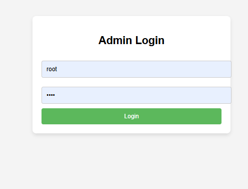
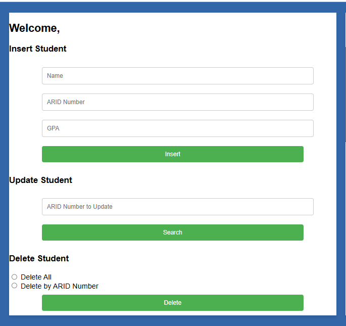
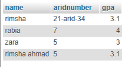

# Admin Dashboard for Student Management

## Overview
This project implements an **Admin Dashboard** using PHP, HTML, CSS, and MySQL to manage student data. It provides functionalities to:
1. **Sign in as an admin.**
2. **Insert, update, delete, search, and display student records.**
3. Handle input validation and display appropriate error messages.

## Features
1. **Admin Authentication**:
   - Sign in using email and password from the `admin` table.
   - If the credentials are incorrect or fields are empty, an error message is displayed.

2. **Student Management**:
   - **Insert**: Add a new student record with fields: `name`, `arid-number`, and `gpa`.
   - **Update**: Update an existing student's information using their `arid-number`.
   - **Delete**: 
     - Delete all records.
     - Delete a record by searching for the `arid-number`.
   - **Search**: Find and display a student's details using their `arid-number`.
   - **Show All**: Display all records from the `student` table in a dynamic table.

3. **Error Handling**:
   - Displays an error if any field is empty or invalid.
   - Handles cases where a record is not found in the database.

## Setup Instructions
1. **Database Setup**:
   - Create a MySQL database named `student_management`.
   - Create the following tables:
     ```sql
     CREATE TABLE admin (
         id INT AUTO_INCREMENT PRIMARY KEY,
         email VARCHAR(255) NOT NULL UNIQUE,
         password VARCHAR(255) NOT NULL
     );

     CREATE TABLE student (
         id INT AUTO_INCREMENT PRIMARY KEY,
         name VARCHAR(255) NOT NULL,
         arid_number VARCHAR(255) NOT NULL UNIQUE,
         gpa DECIMAL(3, 2) NOT NULL
     );
     ```
   - Insert a sample admin user:
     ```sql
     INSERT INTO admin (email, password) VALUES ('admin@example.com', 'password123');
     ```

2. **Configure `dashboard.php`**:
   - Add your database credentials:
     ```php
     $servername = "localhost";
     $username = "root";
     $password = "";
     $dbname = "student_management";

     $conn = new mysqli($servername, $username, $password, $dbname);

     if ($conn->connect_error) {
         die("Connection failed: " . $conn->connect_error);
     }
     ```

3. **Run the Application**:
   - Start your local server (e.g., XAMPP or WAMP).
   - Place the project folder in the `htdocs` directory.
   - Open your browser and navigate to `http://localhost/project/login.php`.

## How It Works
### 1. **Sign In**:
- Enter the admin email and password to access the dashboard.
- Invalid credentials or empty fields trigger an alert.

### 2. **Dashboard Functionalities**:
#### **Insert**:
- Add a new student by entering their `name`, `arid-number`, and `gpa`.

#### **Update**:
- Enter the `arid-number` to search for a student.
- If the student exists, their current details are shown for editing.

#### **Delete**:
- Choose between:
  1. Delete all records.
  2. Delete by entering an `arid-number`.

#### **Search**:
- Enter an `arid-number` to find and display the student's details.

#### **Show All**:
- Displays all student records in a tabular format.

## Output Examples
### Admin Login Page


### Dashboard View


### Student Records Table


## Key Concepts Covered
1. **PHP and MySQL Integration**:
   - Using `mysqli` for database operations like `INSERT`, `UPDATE`, `DELETE`, and `SELECT`.

2. **CRUD Operations**:
   - Comprehensive implementation of Create, Read, Update, Delete functionalities.

3. **Form Handling**:
   - Validating user input and providing feedback.

4. **Error Handling**:
   - Displaying errors for empty fields, invalid inputs, and database operation failures.

5. **Dynamic Table Generation**:
   - Fetching data from the database and dynamically generating an HTML table.

6. **Session Management**:
   - Securely managing admin login sessions.

7. **Responsive Design**:
   - Clean, user-friendly layout using CSS.

## Next Steps
- **Security Enhancements**:
  - Hash passwords in the `admin` table using `password_hash()`.
  - Use prepared statements to prevent SQL injection.
- **Frontend Enhancements**:
  - Add JavaScript validation for faster feedback.
  - Use frameworks like Bootstrap for a polished design.
